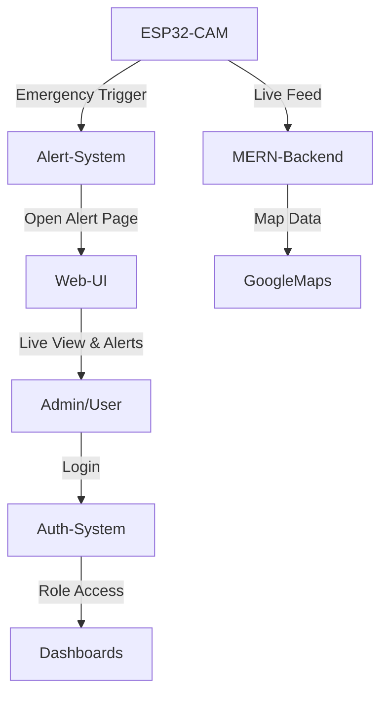

# IoT-Based Smart Surveillance System

A smart and scalable real-time surveillance solution using **ESP32-CAM** and a **MERN Stack-based web application**. This system enables 24/7 monitoring of isolated or sensitive locations and integrates a user-friendly alert mechanism with **Emergency Alert hardware triggers**, real-time map views, and role-based dashboards.

---

## 🚀 Project Overview

The **IoT-Based Smart Surveillance System** addresses the need for continuous security surveillance and fast emergency response, especially in isolated or high-risk areas. The system uses an ESP32-CAM module to stream video in real-time and detect any unusual activities. In parallel, a responsive web portal built with the MERN (MongoDB, Express.js, React.js, Node.js) stack is used to monitor and control the system from any location.

---

## 🔧 Features

### ✅ Real-Time Surveillance
- Continuous video streaming using **ESP32-CAM**.
- Camera configured to work wirelessly on local or cloud-based networks.

### ✅ Emergency Alert System
- **Hardware-triggered Emergency Alert Button** integrated with ESP32.
- On pressing, it sends a real-time signal to the MERN website and opens the **Alert Page** for rapid action.

### ✅ User & Admin Dashboards
- **Role-based login** using secure authentication.
- **Admin Dashboard**:
  - View live streams and alerts.
  - Manage users and camera nodes.
- **User Dashboard**:
  - Access assigned camera feeds and alert history.

### ✅ Interactive Map View
- Displays real-time locations of surveillance nodes.
- Highlights areas where alerts are triggered.
- Integrated with **Google Maps API** or **Leaflet**.

### ✅ Alert Page
- Automatically triggered when the Emergency Alert Button is pressed.
- Shows live camera stream, location, and alert message.
- Designed for quick acknowledgment and response.

---

## 🧠 Technologies Used

### 🔌 IoT Hardware
- **ESP32-CAM**:
  - Captures video and transmits over Wi-Fi.
  - Configured to run 24/7 for continuous surveillance.
- **Emergency Alert Button**:
  - Connected to ESP32.
  - Sends an interrupt signal to trigger an alert page on the website.

### 🌐 Web Development – MERN Stack
- **MongoDB** – NoSQL database to store user data, alerts, and device logs.
- **Express.js** – API handling and routing.
- **React.js** – Dynamic frontend with responsive UI.
- **Node.js** – Backend logic, authentication, and WebSocket communication.

---

## 🖥️ System Architecture



---

## 🛠️ Installation & Setup

### Prerequisites

- Node.js & npm
- MongoDB installed locally or use MongoDB Atlas
- Arduino IDE (for ESP32-CAM setup)
- Git

### 1. Clone the Repository

```bash
git clone https://github.com/SriRev/IoT-Based-Smart-city-surveillance.git
cd IoT-Based-Smart-city-surveillance
```

### 2. Setup ESP32-CAM

- Open `ESP32-CAM.ino` in Arduino IDE.
- Add WiFi credentials and server endpoint URL.
- Upload code to ESP32-CAM using FTDI programmer.

### 3. Start the Backend Server

```bash
cd backend
npm install
npm start
```

### 4. Start the Frontend (React)

```bash
cd frontend
npm install
npm start
```

### 5. Connect the Emergency Alert Button
- Connect the button to a digital GPIO pin on the ESP32.
- Configure the interrupt in code to send an API call to trigger the alert.

---

## 📸 Screenshots

- **Dashboard View (Admin/User)**
- **Live Camera Feed**
- **Map View with Markers**
- **Alert Page upon Emergency Trigger**

*(You can add `.png` or `.gif` images or links to them here)*

---

## 🔐 Authentication

- JWT-based login system
- Role-based access (Admin/User)
- Secure session management

---

## 🧪 Future Enhancements

- AI-based motion detection and object recognition
- Integration with SMS or email alerts
- Android/iOS app for portable monitoring
- Historical alert data analytics and reports

---

## 🤝 Contributing

Contributions are welcome! Please fork the repository and create a pull request.

